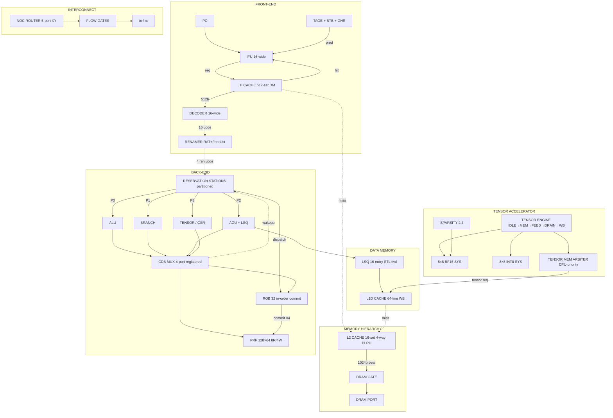

# LOTUS OMNI

**A Superscalar Out-of-Order RISC-V Processor with Systolic Tensor Acceleration,
Structured Sparsity, and a Congestion-Aware Network-on-Chip**

*Developed with AI pair-programming assistance. All synthesis, simulation, and timing
results below were produced and independently verified by the author using Xilinx Vivado 2025.2.*

---

## Overview

LOTUS OMNI is a from-scratch, 4-wide superscalar out-of-order RISC-V processor augmented
with an AI accelerator subsystem. The design was developed, debugged, simulated, and
timing-closed by a single self-taught engineer over approximately nine months of focused
RTL work. It targets the "AI edge processor" class: a general-purpose out-of-order scalar
pipeline fused with a systolic tensor engine, a three-level memory hierarchy, TAGE branch
prediction, a 2-D mesh Network-on-Chip, and credit-based congestion control.

The scalar pipeline is 4-wide from decode through rename, dispatch, issue, and commit, backed
by a 128-entry physical register file with 8 read and 4 write ports. Out-of-order execution is
managed by partitioned reservation stations with vectorised wakeup and a 32-entry reorder
buffer that enforces in-order retirement with precise exception support. The tensor subsystem
orchestrates complete 8×8 matrix multiplications in the background while the scalar pipeline
continues executing, sharing the memory hierarchy through a CPU-priority arbiter.

---

## Key Results

| Metric | Result |
|---|---|
| Target device | Xilinx Artix-7 `xc7a200tl-ffv1156-2L` |
| ISA | RV64I + custom tensor opcode `0x0B` |
| Timing (OOC, post-route) | **Met @ 80 MHz** — WNS **+0.252 ns**, WHS +0.019 ns |
| Timing endpoints | **0 failing / 166,090 total** |
| Tensor verification | **PASS 64/64** (8×8 MATMUL, all results = 2×3×8 = 48) |
| Slice LUTs | 61,546 / 134,600 (45.73%) |
| Slice Registers | 40,250 / 269,200 (14.95%), **0 latches** |
| Block RAM | 17 / 365 tiles (4.66%) |
| DSP48E1 | 64 / 740 (8.65%) |
| Formal assertions | 27 SVA + 7 cover points (tensor engine + memory arbiter) |

---

## Architecture

The figure below shows the complete data-flow architecture. The scalar path runs
`Fetch → L1I → Decode → Rename → Reservation Stations → {ALU, Branch, AGU/LSQ, Tensor/CSR} → CDB → PRF/ROB → Commit`. The tensor path streams weights and activations
through a CPU-priority memory arbiter into dual systolic arrays, and writes results back to
the physical register file over the Common Data Bus.



---

## Tensor Acceleration & Supported Workloads

The accelerator computes 8×8 BF16 and INT8 matrix multiplications at a peak of 64
multiply-accumulate operations per cycle, doubling effective throughput when 2:4 structured
sparsity is enabled. Larger matrices are handled by tiling weight and activation blocks across
successive tensor operations.

The datapath targets the GEMM kernel that underlies neural-network inference. Representative
deployment classes include:

- **Fully-connected and small convolutional networks** (e.g., MNIST-scale classifiers)
- **INT8 quantised TinyML models** such as keyword spotting and micro-speech
- **BF16 inference** for workloads requiring higher numeric accuracy
- **Any GEMM-expressible workload**, the dominant primitive in deep-learning inference

Because tensor operations run in the background under a CPU-priority arbiter, scalar
instruction throughput is preserved while the accelerator streams data.

---

## Module Summary

The design comprises 30 SystemVerilog source files instantiating 35 RTL modules (26 architecturally distinct functional units, 4 internal submodules, and 5 supporting/parameter modules). Every module is completed, synthesised, and behaviourally simulated. Full mathematics, worked numerical examples, per-module fix histories, and the complete scalar bring-up debug journal are documented in [`Docs and Reports/ARCHITECTURE.md`](Docs%20and%20Reports/ARCHITECTURE.md).

| Module | Function |
|---|---|
| `lotus_ifu_masterpiece` | 16-wide fetch with deadlock-free decoupled request channel |
| `lotus_l1i_cache` | 32 KB direct-mapped instruction cache, BRAM-inferred |
| `lotus_tage_predictor` | TAGE + BTB predictor with pipelined training and GHR snapshot FIFO |
| `lotus_decoder_masterpiece` | 16-wide decode into a 128-entry LUTRAM DIQ |
| `lotus_renamer_masterpiece` | Register renaming with 8 branch checkpoints, 1-cycle recovery |
| `lotus_reservation_station_v4` | Partitioned reservation stations with vectorised wakeup |
| `lotus_prf` | 128×64b 8R/4W physical register file, registered one-hot arbitration |
| `lotus_alu_masterpiece` | RV64I ALU, 2-stage pipeline with OR-AND forwarding |
| `lotus_branch_exec` | Branch/jump resolution and mispredict detection |
| `lotus_agu` | Address generation, write masks, misalignment detection |
| `lotus_lsq_masterpiece` | Store queue with CAM store-to-load forwarding |
| `lotus_l1d_cache` | 4 KB write-back data cache, full 512-bit line response |
| `lotus_l2_cache` | 16-set 4-way PLRU unified L2, LUTRAM-only |
| `lotus_prefetcher` | Stride prefetcher with reference-prediction table |
| `lotus_rob_masterpiece` | 32-entry reorder buffer, 4-wide in-order commit |
| `lotus_tensor_engine` | 6-state MATMUL orchestration FSM with CDB writeback |
| `lotus_bf16_systolic_array_8x8_v3` | 8×8 BF16 outer-product broadcast array |
| `lotus_int8_systolic_array_8x8` | 8×8 INT8 outer-product broadcast array |
| `lotus_bf16_tensor_pe` | DSP-mapped BF16 MAC processing element |
| `lotus_tensor_pe` | INT8 MAC processing element with AI saturation |
| `lotus_sparsity_engine_v3` | 2:4 structured sparsity compressor |
| `lotus_tensor_mem_arbiter` | CPU-priority L1D memory arbiter, formally asserted |
| `lotus_noc_router_masterpiece` | 5-port XY-mesh Network-on-Chip router |
| `congestion_aware_flow_gate` | Credit-based flow control with PID throttle |
| `lotus_csr` | Machine-mode and custom tensor/sparsity CSRs |
| `lotus_pmu` | 13-counter hardware performance monitor |
| `lotus_axi4_wrapper` | AXI4-Lite control-plane interface |
| `lotus_omni_core_top_v2` | Top-level integration and timing pipelines |
| `lotus_pkg` | Shared typedef and parameter package |
| `lotus_bf16_mult` | ASIC-portable 3-stage BF16 multiplier |

---

## Implementation Results

The design was implemented out-of-context with Vivado and closes timing at 80 MHz on the
slowest Artix-7 speed grade. The screenshot below shows the post-route timing summary.

<!-- IMAGE: place your Vivado timing summary screenshot at images/implementation_complete.png -->
<p align="center">
  
</p>

### Timing-Closure Campaign

Worst Negative Slack progressed from **-7.019 ns to +0.252 ns** across six targeted iterations, absorbing ~16,300 additional endpoints from the tensor-subsystem integration and L1D full-line datapath widening while maintaining positive slack. The most impactful fixes were the PRF registered one-hot grant arbitration, the ALU 2-stage pipeline split, renamer output registration with pipelined TAGE training, and registered CDB-to-ROB paths. The complete iteration log is in [`Docs/ARCHITECTURE.md`](Docs/Architecture.md).

| Iteration | WNS (ns) | Failing Endpoints | Key Fix |
|---|---|---|---|
| Baseline | -7.019 | 37,499 | PRF unregistered arbitration (combinational priority mux) |
| +PRF fix | -4.304 | — | Registered one-hot grant arbitration |
| +ALU pipeline | -3.345 | 9,555 | EX1/EX2 pipeline split (register the operands) |
| +Renamer/TAGE | -2.282 | 7,052 | Renamer output registration, pipelined TAGE training |
| +RS clamps | -1.739 | 2,102 | Pure-arithmetic occupancy (remove comparator clamps) |
| +ROB/PMU/LSQ | -0.952 | 2,102 | CDB→ROB registered path, counter pipelining |
| **Final @80 MHz** | **+0.109** | **0** | Clock period relaxed to 12.5 ns |
| +Tensor + L1D full-line | **+0.141** | **0** | Outer-product systolic arrays, Tensor Engine v3.0.0, L1D V8.0 512-bit response (+7,300 endpoints) |
| +BF16 mult + NoC refactor | **+0.252** | **0** | `lotus_bf16_mult` V4.0, flow-gate refactor, L1I V4.2 X-state fix, IFU V1.1 deadlock fix (+8,987 endpoints) |

---

## Verification

- **Scalar functional:** the full fetch, decode, rename, dispatch, issue, execute, writeback
  and commit pipeline is observed running concurrently in behavioural simulation.
- **Tensor functional:** a self-checking testbench loads weights=2 and activations=3, runs a
  full 8×8 MATMUL through the systolic array, and verifies all 64 physical-register results
  equal the expected value 48 (0x30), reporting **PASS 64/64**.
- **Formal assertions:** 15 SystemVerilog Assertions guard the tensor-engine protocol and
  12 assertions plus 7 cover points guard the memory-arbiter protocol.
- Raw synthesis, implementation, timing, utilisation, and DRC reports are archived in
  `Docs and Reports/reports/`.

---

## Scalar Bring-Up Status & Debug Journal

The scalar pipeline has been brought up incrementally through systematic, signal-level
debugging. The table below documents every bug identified, its root cause, and the fix
applied — the same methodology a silicon bring-up engineer would apply to post-silicon
bring-up.

| # | Bug | Root Cause | Fix | Version |
|---|---|---|---|---|
| 1 | ALU CDB rob_idx timing mismatch | Combinational rob_idx path to PRF | Registered rob_idx at ALU output | `lotus_omni_core_top_v2` V10.x |
| 2 | Load p_dest timing mismatch | Load p_dest not pipelined to CDB | Pipelined load p_dest + offset + rob_idx | `lotus_omni_core_top_v2` V10.x |
| 3 | RS occupancy underflow | Conditional clamps on `n_occupancy` | Pure-arithmetic occupancy (no clamps) | `lotus_reservation_station_v4` V5.6 |
| 4 | ROB store completion path | `agu_completes` not wired to CDB port 3 | Wired `agu_completes` to CDB port 3 | `lotus_omni_core_top_v2` V10.8 |
| 5 | `commit_is_store` always 0 | Derived from `is_memory && !is_branch` (true for loads too) | Derived from RV64I STORE opcode `7'b0100011` | `lotus_rob_masterpiece` V8.3 |
| 6 | Conditional branches never complete | `cdb_valid` only asserted for JAL/JALR | All branches assert `cdb_valid=1` on resolution | `lotus_branch_exec` V2.1 |
| 7 | Simulation X-state propagation | BRAM/LUTRAM arrays uninitialised in XSim | Added `initial` blocks to all RAM modules | `lotus_l1i_cache` V4.2, `lotus_l1d_cache` V8.0, `lotus_l2_cache` V7.6, `lotus_reservation_station_v4` V5.8, `lotus_prefetcher` V1.6, `lotus_tage_predictor` V2.8, `decoder_diq_bank` |
| 8 | CSR illegal-instruction trap loop | `cycle`/`instret` CSRs not implemented | Added `cycle_counter` mapped to 0xC00/0xC01/0xC002/0xB00/0xB02 | `lotus_csr` V1.1 |
| 9 | RS slots permanently lost | `rs_issued`/`rs_reserved` never cleared on dispatch | Clear both flags on slot reuse | `lotus_reservation_station_v4` V5.8 |
| 10 | PRF stale read (AGU base = 0) | PRF read not muxed with CDB forwarded data | Added `src1_is_cdb`/`src2_is_cdb` tracking + combinational PRF rd-addr + same-cycle write-first bypass | `lotus_reservation_station_v4` V5.8, `lotus_prf` V4.2 |
| 11 | LSQ draining stores with addr=0 | Drain logic not gated on `addr_valid`/`data_valid` | Added `addr_valid` and `data_valid` checks to drain | `lotus_lsq_masterpiece` V3.8 |
| 12 | L1D hang on MMIO store | MMIO/UART store responses not absorbed | Added `MMIO_SINK` FSM state | `lotus_l1d_cache` V8.1 |
| 13 | LSQ deadlock (loads polluting SQ) | Loads allocated into Store Queue | Restricted SQ allocation to stores only | `lotus_omni_core_top_v2` V11.1 |

**Current status:** 15 in-order commits observed under the `tb_lotus_coretest` scalar
bring-up workload. The remaining active debug target is the store-drain → L1D `MMIO_SINK`
→ UART-observe handshake completion.

---

## Known Issues & Future Work

### Known Issues
- Scalar bring-up incomplete: the `tb_lotus_coretest` workload reaches 15 commits but the
  full store-drain → L1D → UART path has not yet been closed.
- `lotus_pkg` `RS_DEPTH` localparam (16) is stale — the actual synthesised depth is 8
  (overridden at top-level). This is a documentation issue only; functionally harmless.
- `SQ_DEPTH` localparam in `lotus_pkg` (8) differs from the LSQ module default (16). The
  top-level overrides to 16; functionally correct but the package comment should be updated.

### Planned Work
1. **Close scalar bring-up:** complete the store-drain → L1D `MMIO_SINK` → UART-observe
  handshake and run the full CoreMark benchmark.
2. **RISC-V Compliance Suite:** run the official RISC-V compliance test suite and implement
  automated scalar commit-value checking in the testbench.
3. **Physical board bring-up:** build a bitstream-buildable top-level wrapper with real DRAM
  and AXI interconnect, and bring up the design on a physical Artix-7 FPGA development board.
4. **Decoder-driven tensor issue:** drive tensor operations from the decoded instruction path
  (rather than testbench injection), enabling the compiler to emit tensor instructions directly.
5. **Pipelined tensor arbiter & multi-outstanding memory:** pipeline the tensor memory arbiter
  and support multiple outstanding memory transactions to overlap latency between successive
  tensor operations.
6. **2→4-issue scaling & multi-core:** tune the pipeline for full 4-issue operation (currently
  limited to 2-issue in some paths) and integrate a second core tile connected via the NoC,
  moving toward a dual-core AI edge processor.

---

## Getting Started

**Requirements:** Xilinx Vivado 2025.2, Xilinx Simulator (XSim).

1. Create a new RTL project and add all files under `RTL/` (compile `lotus_pkg.sv` first)
   and `Constraints/`.
2. Set the top module to `lotus_axi4_wrapper`, run synthesis, then implementation, then
   `report_timing_summary` (expect timing met at 80 MHz).
3. For behavioural simulation, set a testbench under `TB/` as the simulation top and run:
   - `tb_lotus_core_demo3` — full-core scalar plus tensor MATMUL with self-check (64/64)
   - `tb_lotus_ifu_demo2` — instruction-fetch demonstration
   - `tb_lotus_axi4_wrapper` — AXI control-plane demonstration
   - `tb_lotus_coretest` — scalar bring-up workload (currently at 15 commits)

---

## Repository Structure

```
lotus-omni/
├── RTL/                              # 30 SystemVerilog source files
├── TB/                               # Self-checking testbenches
├── Constraints/                      # Out-of-context timing constraints (80 MHz)
├── Docs and Reports/
│   ├── ARCHITECTURE.md               # Full microarchitecture reference (35 modules)
│   │                                 # + complete scalar bring-up debug journal
│   ├── Reports (.rpt file type)/     # Raw Vivado timing / utilisation / DRC reports
│   └── Reported screenshot/          # Vivado design screenshots
│                                     #   (Dataflow, Elaborated, Synthesized,
│                                     #    Implemented, Schematic, floorplan)
├── Simulation Screenshot/            # Behavioural-simulation waveforms
│                                     #   (Demo 1 AXI, Demo 2 IFU, Demo 3 full-core+tensor)
├── .gitattributes
├── .gitignore
└── README.md
```

---

## Documentation

The primary reference is [`Docs/ARCHITECTURE.md`](Docs/Architecture.md), which documents every module with its mathematical formulation, a worked numerical example, a complete per-module fix history, and the full scalar bring-up debug journal (13 bugs identified, root-caused, and fixed with signal-level evidence). Timing-closure details are in `Docs and Reports/reports/`.

---

## AI-Assistance Disclosure

AI pair-programming tools were used for code review, debugging, and documentation. The RTL
design decisions, synthesis runs, simulation verification, and timing closure were performed
and confirmed by the author using real Vivado tool output, archived in this repository.

---

## Author

**Sanuka Nethmira Amarasekara**
Independent Digital Design Engineer | Self-Directed RISC-V/FPGA Research

- **Email:** nethmirasanuak@gmail.com
- **LinkedIn:** [linkedin.com/in/sanuka-nethmira-amarasekara](https://www.linkedin.com/in/sanuka-nethmira-amarasekara)
